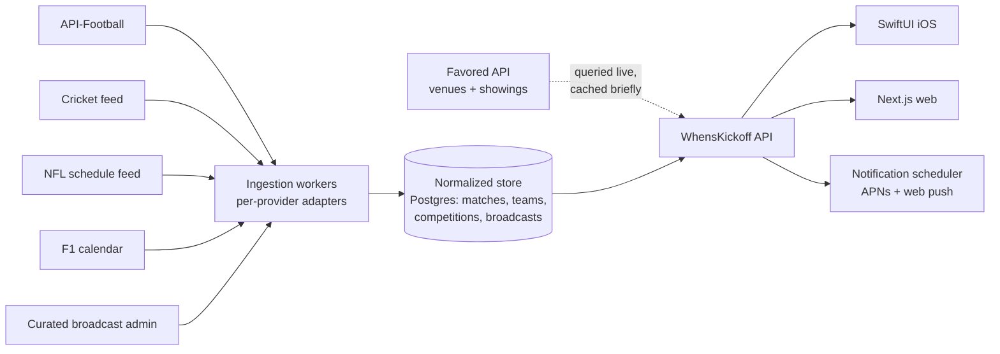

# 04 · Data & licensing

The product's credibility lives or dies on three datasets: **fixtures** (when), **broadcast** (what channel, per country), and **venues** (who's showing it, near you). This doc sets a strategy for each, plus the IP questions around crests and marks.

## 1. Canonical match model

Everything ingested gets normalized into one model; every screen renders from it:

```
Match {
  id, sport, competition { id, name, stage },
  participants [ { teamId, name, short, crestRef } ],   // 2 teams, or a field (F1)
  kickoffUtc,                                           // the only stored time — see 05 timezone doctrine
  status { phase: upcoming|live|finished, minute?, score? },
  broadcasts [ { country, channelId, channelName, coverageStartUtc?, streamUrl?, affiliateTag? } ],
  venueSummary { nearbyShowingCount? }                  // resolved per-user at query time via Favored
}
```

## 2. Fixtures & scores — provider comparison

| Provider | Coverage | Price posture | Redistribution terms | Live latency | Verdict |
|---|---|---|---|---|---|
| **API-Football** (api-sports.io) | Football: excellent, global | ~£0–300/mo tiers | app use OK on paid tiers | good (min-by-min) | **v1 primary for football** |
| **SportMonks** | Football strong, cricket product exists | ~£30–300/mo | similar | good | football alt; **cricket candidate** |
| **TheSportsDB** | Broad multi-sport, community-sourced | free/cheap patron | permissive | patchy | prototype/fallback only — accuracy risk for a product whose whole promise is the right time |
| **football-data.org** | European football | free–low | non-commercial leanings at free tier | ok | dev/testing only |
| **Sportradar** | Everything incl. NFL, cricket, F1, official feeds | £high, per-sport contracts | negotiated | best | **the consolidation path once revenue justifies it** |
| League-direct (NFL, F1 public schedule data) | own sport | free-ish for schedules | ToS-bound | n/a for live | schedules workable; live scores not |

**The plain finding:** *no affordable single provider covers football + cricket + NFL (+ rugby + F1) well.* Therefore:

> **v1 recommendation — stitch per-sport providers behind one ingestion layer.** Named primaries: API-Football (football), SportMonks or CricAPI (cricket), league schedule data + a modest feed for NFL, official calendar for F1 (schedules only — race *start times* are the product need; live timing is out of scope). The normalized model above absorbs the mess; clients never know. Consolidate onto Sportradar when revenue supports a contract.

Costs at v1 scale: low hundreds £/month total. The real cost is engineering the ingestion workers and the reconciliation (team-name mapping across providers) — budget for that, not the API bills.

## 3. TV listings ("on the box"), per country

Broadcast data is the sleeper licensing problem: comprehensive EPG data (Gracenote et al.) is licensed and expensive, and rights change constantly.

**v1 recommendation — manually curated broadcast data for top competitions.** The insight: the product doesn't need the full EPG; it needs *"which channel shows THIS match"* for the ~20 competitions users actually follow. That's a small, high-value dataset — effectively what wheresthematch curates — maintainable by one person-hour a day with an admin screen, seeded per country:

- **UK:** Sky Sports (+ which sub-channel), TNT Sports, Amazon Prime, BBC/ITV (free-to-air windows), Discovery+, DAZN. Include channel numbers ("Sky ch. 410") and coverage start ("Coverage from 17:00") as in the designs.
- **US (NYC):** NBC/Peacock (EPL), ESPN+, Fox, Paramount+ (UCL).
- **UAE (Dubai):** beIN Sports dominance; venue-first behaviour is even stronger — many expats have no home subscription.
- **Singapore:** StarHub/Hub Sports, mio; similar venue-first dynamics.
- **Australia (Sydney):** Optus Sport (EPL), Kayo/Fox, free-to-air cricket.

Automate later (Gracenote licence or broadcaster partnerships) once the curation load or country count makes manual untenable. Affiliate tags (see [03](03-monetization.md)) ride on these rows from day one.

## 4. Venues — the Favored API <a id="favored"></a>

Venue data comes from Favored (favored.ai). **Hard rule carried over from the designs: every venue surface renders "powered by Favored"** (pink `#ef7fae` wordmark) — list cards, venue detail, map bottom-cards, match-detail carousels.

**Required API surface (assumed, needs confirming with the Favored team):**

| Capability | Used by | Exists today? |
|---|---|---|
| Geo search (lat/lng + radius, type filter pub/bar/restaurant) | Nearby, Map | presumably |
| Rating + review count | badges everywhere | presumably |
| Photos | cards, venue hero | presumably |
| "Favored says" editorial quote | venue detail quote card | presumably |
| Amenities (screens count, garden, food hours, dogs, late licence) | venue detail, filters, night-owl nudge | partial? |
| Booking deep-link / referral tracking | Book table | presumably |
| **Per-venue, per-fixture "showing this" declarations** (+ room/sound notes: "Main bar + garden · sound on") | *the entire B layer* | **almost certainly not** |

**The biggest single dependency in the whole product is that last row.** "Which pub is showing which match" is not scrapeable and not in any public dataset; Fanzo solved it with a decade of venue-side tooling where landlords declare their screenings. The options:

1. **Favored builds a declaration flow** into its venue dashboard ("Which of this week's fixtures are you showing? Which room? Sound on?") — cleanest ownership, since venues are Favored's relationship.
2. **WhensKickoff builds a lightweight venue portal** (magic-link, tick the fixtures) and writes back through the API — faster to start, messier long-term.
3. **Manual concierge for the pilot** — someone phones/messages 50 London venues weekly. Unsexy, correct for proving demand before building tooling.

Recommendation: **start with 3 for the pilot, commit to 1 as the scaling path.** Decide before v1.5 scoping. And a product rule regardless of path: **stale beats wrong** — a declaration older than the fixture week gets demoted to "usually shows football" phrasing rather than asserting "showing this".

## 5. Crests, logos & IP

- The design mockups (and the prototype in this repo) hotlink club crests from Wikipedia/Wikimedia. **That is a mockup convenience only** — club crests are trademarks; production use needs licensed assets.
- Production options, in order of preference: (1) **licensed image packs via the data provider** (API-Football and Sportradar both offer media add-ons — cheapest legitimate path); (2) direct league licensing (Premier League/NFL programmes — slow, expensive); (3) **designed fallback: colored-monogram circles** (the prototype already implements this as its image-error fallback — it's an acceptable v1 aesthetic if licensing drags).
- Team/competition *names* used factually (fixture listings) are generally fine; using marks in *advertising* the app is not. Get one legal review before the App Store submission, not after.
- If this repo's prototype is ever published (e.g. GitHub Pages) to show partners, swap crests to monograms first or keep the URL private — hotlinked crests on a public marketing URL is exactly the "advertising use" that invites letters.

## 6. Ingestion architecture



Posture: fixtures sync on schedules (hourly; minutely near kickoff for live status), broadcast data is human-curated, venue data is **queried from Favored at request time** (their data, their freshness) with short-lived caching. Rate limits and provider outages are absorbed in the ingestion layer — clients only ever see the normalized store.

---
*Previous: [03 · Monetization](03-monetization.md) · Next: [05 · Platform & architecture](05-platform-architecture.md)*
