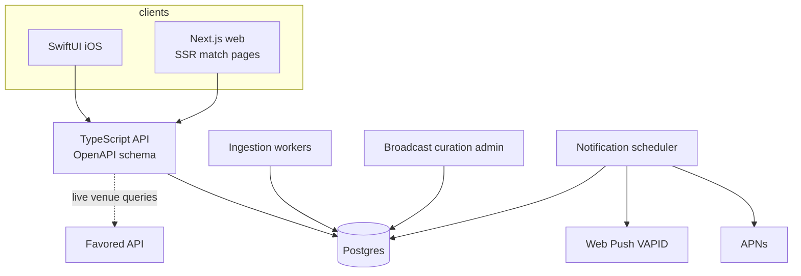

# 05 · Platform & architecture

## 1. Recommendation (locked)

> **Native SwiftUI iOS app + Next.js web app, sharing one backend API.**

Two codebases is the expensive option and it's still the right one here, because the two platforms are doing different jobs: **iOS is the retention product** (push, widgets, Live Activities), **web is the acquisition product** (SEO, shareable links, zero-install tournament traffic).

## 2. Alternatives compared

| | **SwiftUI + Next.js** (chosen) | Expo / React Native (+ web) | Web-first PWA |
|---|---|---|---|
| Native feel & polish | ★★★ | ★★ good-not-perfect | ★ |
| Push notifications | APNs first-class | fine via Expo | web push only; iOS PWA push exists but users must A2HS first — deadly for the *core loop* |
| **Widgets / Live Activities** | ✔ full | partial, native modules needed | ✘ |
| Web SEO | ★★★ (Next.js SSR) | ★ (react-native-web SEO is painful) | ★★★ |
| Dev cost (small team) | highest | lowest for both platforms | lowest overall |
| Hiring/maintainability | two skill sets | one | one |
| Android later | new codebase | nearly free | free-ish |

**Why the extra cost is justified — two product-led reasons:**

1. **The kickoff countdown belongs in the Dynamic Island.** A Live Activity showing "LIV v MCI — kicks off in 12m" (then the live score) is not a nicety; it's the single most on-proposition thing an iOS app can do, and it's SwiftUI-native territory. Same for a home-screen widget of today's kickoffs. The bell is the product; iOS is where the bell lives.
2. **"chelsea vs arsenal what channel" is an acquisition channel.** Those long-tail queries are exactly our match-detail page. That demands a crawlable, fast, server-rendered web app with one URL per match — Next.js's home turf and react-native-web's weakness. Web pages double as the share targets ("Where are we watching? → link").

**When Expo would win instead** (honest note): if the team is 1–2 engineers total and Android is wanted within a year, Expo's one-codebase economics beat both arguments above. Revisit if team shape changes.

**PWA-only** was rejected because the retention loop depends on reliable push and lock-screen presence; iOS web push requires add-to-home-screen first, which kills the funnel for mainstream users.

## 3. Backend sketch

Lightweight and boring on purpose: **TypeScript API (Fastify/Nest on Node) + Postgres**, fixture-ingestion workers (per-provider adapters per [04](04-data-and-licensing.md)), a notification scheduler, and a tiny admin for curated broadcast data.

- **One OpenAPI schema** is the contract; Swift and TypeScript clients are generated from it, which keeps the two-codebase tax down.
- **Design tokens as shared source of truth:** the prototype's [`prototype/css/tokens.css`](../prototype/css/tokens.css) is the seed — promote it to a tokens JSON consumed by both the web CSS and a generated Swift `Theme` file.

## 4. Notifications

- **Model:** reminders are *kickoff-relative*, not absolute — stored as `(fixtureId, offset)` per the design's chips (15 min before / kickoff / full-time). The scheduler materializes send-times from `kickoffUtc` and **re-materializes when a fixture moves** (postponements, TV-picks rescheduling — constant in football). This re-scheduling behaviour is a genuine differentiator over calendar entries.
- **Channels:** APNs (iOS) and VAPID web push (web). Full-time alerts need the live-status feed; 15-min/kickoff alerts only need schedules — which conveniently matches the cheap-data v1.
- **Quiet hours & the night-owl class:** late-night fixtures (kickoff 00:00–06:00 local) get the special treatment from the designs — an *evening-before* nudge ("🦉 Late one tonight… 2 pubs near you have a late licence") instead of a 01:05 buzz, unless the user opts into wake-me-up mode.

## 5. Timezone doctrine (founding competence)

The company exists because timezones are fumbled everywhere else. Doctrine:

1. **Store UTC only.** `kickoffUtc` is the single source of truth; no local times in the database, ever.
2. **Render in the viewer's IANA zone** (`Europe/London`, not "GMT+1") at display time — `Intl.DateTimeFormat` on web, `TimeZone.current`/`Date.FormatStyle` on iOS. Never precompute local times server-side; server-rendered web pages localize client-side (or per-request from a zone hint) to keep cached pages zone-agnostic.
3. **DST edges are product moments, not bugs:** a fixture that's 20:00 for you this week and 19:00 next week (clocks changed in one country but not the other) should be *explained* ("clocks went back in the UK"), because that's exactly the confusion the product monetizes.
4. **Relative framing everywhere:** "Kicks off in 3h 12m", "TODAY · YOUR TIME", and honest day boundaries — a Saturday 21:00 ET match is *Sunday 02:00* for London and the UI must say Sunday.
5. **Dual-zone sets** (premium, [03](03-monetization.md)): "my time + home time" for expats.

## 6. What the prototype does and doesn't validate

The [clickable prototype](../prototype/) in this repo demonstrates the *experience* — flows, tone, the Favored integration surfaces, timezone-relative rendering (it genuinely computes times against the viewer's clock) — and is the design-token seed. It validates **nothing** about: data feasibility (mock data), notification delivery, venue data accuracy, or performance. Treat it as an argument, not an artifact of the product.

---
*Previous: [04 · Data & licensing](04-data-and-licensing.md) · Next: [06 · Roadmap](06-roadmap.md)*
