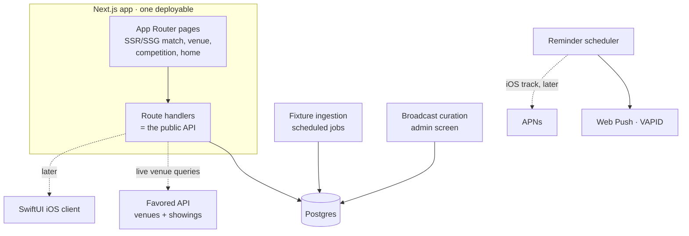

# 05 · Platform & architecture

## 1. Recommendation (locked)

> **One simple web app, built with Next.js (React, TypeScript, App Router). iOS is a separate, later track that reuses the same API — not built now.**

The decision is to ship **web only** first and keep it as simple as possible: a single Next.js application that both renders the pages *and* serves the API (via route handlers), backed by Postgres. No native app, no second codebase, no separate backend service to stand up on day one. When the web product has proven its retention, iOS is picked up as its own project against the API this app already exposes.

## 2. Why web-first, and why Next.js

**Why web first**
- **Fastest path to launch** — no App Store review, no native toolchain, no device provisioning. Push a URL and you're live.
- **Acquisition is a web job anyway.** "chelsea vs arsenal what channel" long-tail searches are exactly our match pages; a crawlable, server-rendered site is the whole acquisition channel, and every match/venue page doubles as a shareable link ("where are we watching? → link").
- **Reaches everyone immediately** — desktop, Android, and iOS all open a web app; the native app is an *enhancement* for the iOS retention loop, not a prerequisite to being usable.

**Why Next.js specifically** (the most appropriate choice for *this* app)
- **SSR/SSG for SEO** out of the box — one URL per match/venue/competition, server-rendered and fast. This is the single biggest reason to pick it over a plain SPA.
- **One deployable, minimum moving parts.** App Router pages + a handful of API route handlers = frontend and backend in one repo, one deploy (Vercel or any Node host). That is genuinely the *"really simple"* setup — you don't run a separate API service until scale demands it.
- **A clean API seam for later.** The route handlers become the public API the iOS app consumes verbatim; nothing is thrown away when native work starts.
- **Design tokens carry over** — the prototype's [`tokens.css`](../prototype/css/tokens.css) becomes the web app's CSS variables / Tailwind theme directly.

**Why not the alternatives, now**
- **Plain React SPA (Vite):** simpler build, but no server rendering → the SEO acquisition channel evaporates. Wrong trade for a product whose growth story is search.
- **Astro / static site:** superb SEO and simplicity, but the app is genuinely interactive (follows, filters, reminders, live countdown) — Next.js handles both content and app-like state; Astro would fight the app half.
- **React Native / Expo:** only pays off when you want iOS + web from one codebase *now*. You've explicitly deferred iOS, so cross-platform machinery is complexity you don't need yet.
- **Native iOS now:** the most retention-optimal long-term, but slower and heavier than the goal here — deferred to its own track by choice.

## 3. How iOS slots in later (separately)

The API boundary is the seam. When iOS is picked up:
- It's a **native SwiftUI client** (recommended for the retention features below) — or Expo if a shared codebase becomes attractive at that point — consuming the exact endpoints this web app already serves.
- It's where the **retention-signature features** live that the web can't match: **Live Activities / Dynamic Island** ("LIV v MCI — kicks off in 12m", then the live score) and a home-screen widget of today's kickoffs. The bell is the product; iOS is eventually where the bell is loudest. Notifications there use **APNs**.
- Nothing about the web build blocks this: the data model, timezone doctrine, and API are shared. iOS is additive.

Android stays further out still — considered only after iOS.

## 4. Backend sketch (kept deliberately small)

- **Venues come from the Favored API** (see [04 §4](04-data-and-licensing.md#favored)) — queried at request time and briefly cached; the app integrates Favored, it doesn't store venue data.
- **Fixtures** are ingested on a schedule into Postgres ([04 §2](04-data-and-licensing.md)); **broadcast rows** are curated via a small admin screen ([04 §3](04-data-and-licensing.md)).
- Start with everything in the one Next.js app; split the ingestion workers or API into their own service only if/when load makes it necessary.

## 5. Notifications (web-first)

- **Reminders are kickoff-relative** — stored as `(fixtureId, offset)` (15 min before / kickoff / full-time), materialized from `kickoffUtc` and **re-materialized when a fixture moves** (postponements, TV reschedules — routine in football).
- **Two delivery mechanisms, simplest-first:**
  1. **Add-to-calendar (.ics)** — a universal, zero-infrastructure reminder that works on *every* device including iOS Safari, where web push is restricted. This is the robust v1 default.
  2. **Web push (VAPID)** — richer, for desktop and Android browsers (and iOS only once installed as a PWA). An enhancement layered on top, not the foundation.
- **APNs** arrives with the iOS track, when lock-screen reminders and the late-night night-owl nudge become first-class.

## 6. Timezone doctrine (founding competence)

The company exists because timezones are fumbled everywhere else. Doctrine:

1. **Store UTC only.** `kickoffUtc` is the single source of truth; no local times in the database, ever.
2. **Render in the viewer's IANA zone** (`Europe/London`, not "GMT+1") at display time — `Intl.DateTimeFormat` in the browser. Server-rendered pages stay zone-agnostic (localize client-side, or per-request from a zone hint) so cached HTML is reusable across zones.
3. **DST edges are product moments, not bugs** — a fixture that's 20:00 for you this week and 19:00 next (clocks changed in one country, not the other) should be *explained*, because that confusion is exactly what the product monetizes.
4. **Relative framing everywhere** — "Kicks off in 3h 12m", "TODAY · YOUR TIME", honest day boundaries (a Saturday 21:00 ET match is *Sunday 02:00* in London and the UI must say Sunday).
5. **Dual-zone sets** (premium, [03](03-monetization.md)) — "my time + home time" for expats.

The prototype already implements this doctrine live (it computes every kickoff against the viewer's clock), so it's proven in the design, not just asserted.

## 7. What the prototype does and doesn't validate

The [clickable prototype](../prototype/) demonstrates the *experience* — flows, tone, the Favored integration surfaces, timezone-relative rendering — and seeds the design tokens. It validates **nothing** about data feasibility (mock data), reminder delivery, venue-data accuracy, or performance. Treat it as an argument, not an artifact of the product.

---
*Previous: [04 · Data & licensing](04-data-and-licensing.md) · Next: [06 · Roadmap](06-roadmap.md)*
